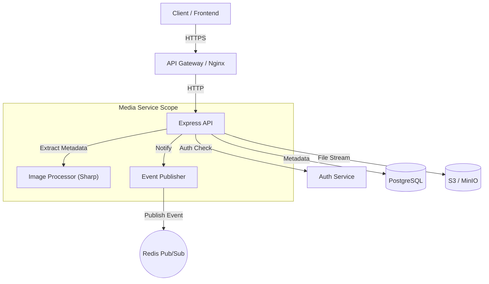
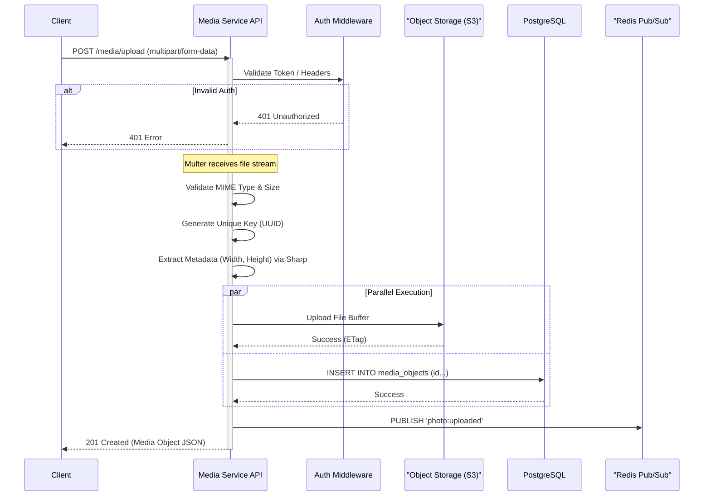
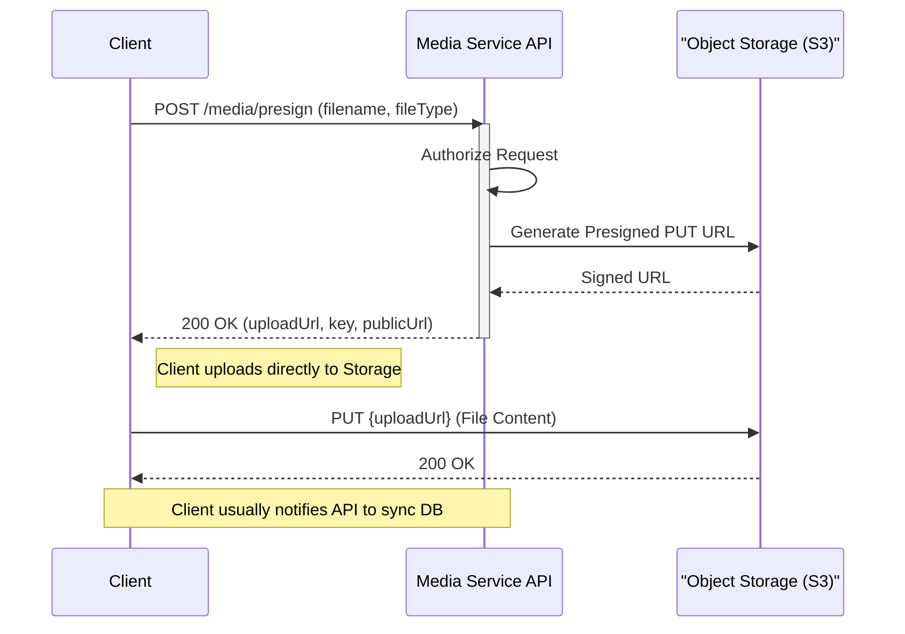
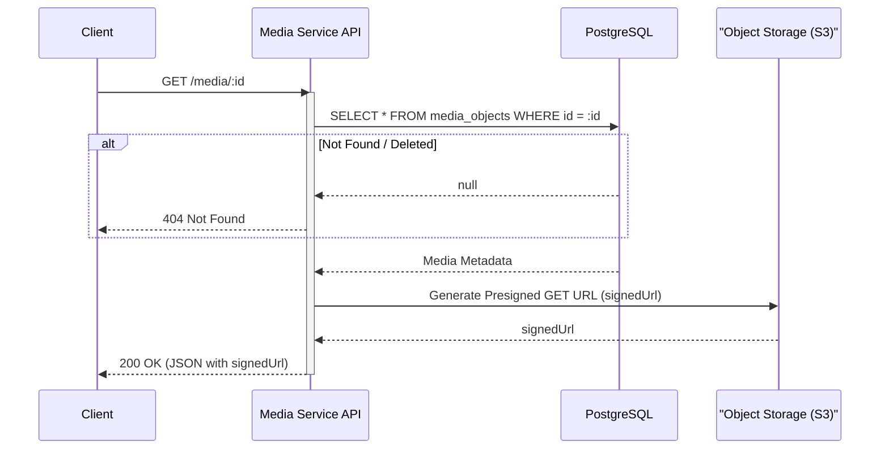
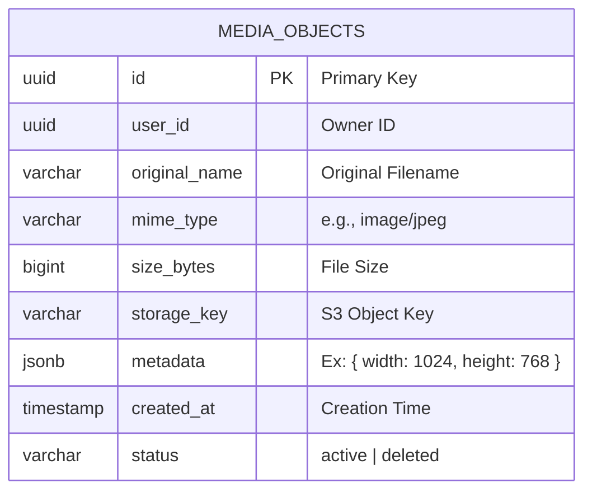

# Media Service Specification & Data Flow

## Overview
The Media Service (`02.Media`) is a dedicated microservice responsible for handling media asset lifecycles. It provides capabilities for secure file uploads, metadata management, and serving media content. The service is designed to be cloud-agnostic (supporting S3-compatible storage) and event-driven.

## System Architecture

The following diagram illustrates the high-level architecture and the interaction between the Media Service and its dependencies:

## Data Flow Workflows

### 1. Direct File Upload (`POST /media/upload`)
This flow handles small to medium-sized file uploads directly through the service.

### 2. Presigned URL Upload (`POST /media/presign`)
This flow is optimized for large files, allowing clients to upload directly to S3.

### 3. Media Retrieval (`GET /media/:id`)

## Database Schema

The service uses a single table `media_objects` in PostgreSQL.

## Event Driven Integration

The Media Service acts as a producer in the system's event-driven architecture using Redis.

| Event Channel | Trigger | Payload Structure | Purpose |
| :--- | :--- | :--- | :--- |
| `photo:uploaded` | Successful upload via `/media/upload` | `{ id, userId, url, ... }` | Triggers downstream tasks like AI analysis, thumbnail generation, or feed updates. |
| `photo:deleted` | API Call to `DELETE /media/:id` | `{ id }` | Notifies other services to remove references to this media. |

## Technical Implementation Details
- **Storage Service (`storage.ts`)**: Wraps AWS SDK `PutObjectCommand` and `GetObjectCommand`. Handles bucket initialization.
- **Processing**: Uses `sharp` to analyze image dimensions before storage.
- **Resilience**: Database records use "Soft Delete" (status='deleted') to prevent immediate data loss.